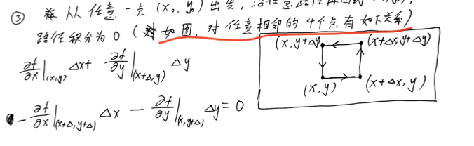
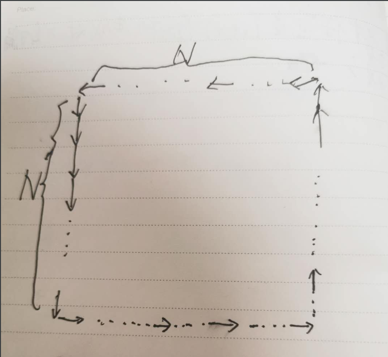

# 思路
数据集可以转换是510*580的矩形Map，xmax = 510， ymax=580，且点与点最小距离都是2，每个点包含这个点的梯度绝对值|Grad|信息
为了计算方便，我们可以把样本截取为一个正方形510*510Map，多余部分数据不考虑。

那么假设数据为N*N个点，已知最小距离delta_t = delta_x = delta_y。
对于任意点A(a1,a2)我们随机生成它对x的偏导x'，且满足(-|Grad|<x'<|Grad|),那么它对y的偏导y'就是正负sqrt(|Grad|^2-x'^2),
根据下图对于2*2的map公式

由于对y的偏导可以写成正负sqrt(|Grad|^2-x'^2)，已知delta_t = delta_x = delta_y，所以这个函数的随机变量就是x1'，x2'，x3'，x4'
只要我们随机生成的x1'，x2'，x3'，x4'使得函数趋近于0，即得出函数梯度信息。
即这个问题可以转化为单目标最优问题。

我们对上图公式扩展为

那么我们就可以得到一个关于x'(0,0),......,x'(n,n)只有外围点，的函数T～x1'，x2'....xm'。

继续拓展

对于每一层我们都得到一个这样的函数，T1,T2,....,Tm.，将这些函数求和得到函数L~x1'，x2'，x3'....xn*n'.所以只要L取得越接近0，我们得到的梯度信息就越精确。

这样问题就可以变为一个N*N维单目标演化问题。